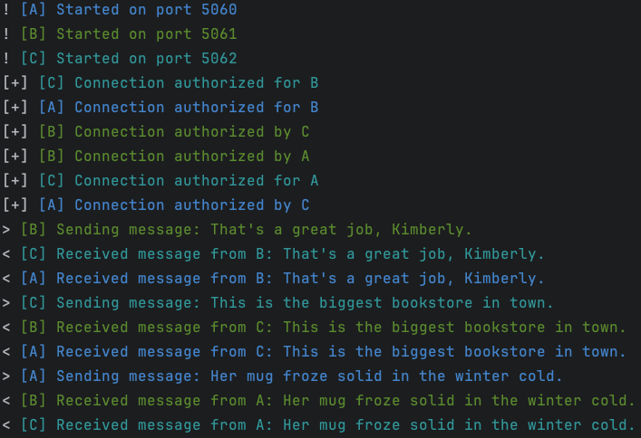

# SimpleRepeat Documentation

## 📄 Introduction
**SimpleRepeat** demonstrates the use of the **BlueProtocol** library for TCP communication between multiple "bots".
Each bot connects directly to other bots, sends and receives messages, and prints the received messages to the console
via a port scan starting from the `StartingPort` defined in the configuration.

## 🔍 Overview
1. **Read sentences**: Reads phrases from `sentences.txt`.
2. **Create bots**: Three bots with unique IDs and console colors.
3. **Start bots**: Bots start, connect, and exchange messages.

## 💻 Code Structure

### Class `Program`
- **Main Method**:
  - Reads sentences from a file.
  - Creates a list of bots.
  - Starts each bot and waits for their completion.

- **CreateBots Method**:
  - Initializes bots with unique IDs, starting ports, console colors, and phrases.

### Class `Config`
- Contains configuration constants:
  - `StartingPort`: Initial port for bots (5060).
  - `SimulationDuration`: Simulation duration in milliseconds (60000 ms).
  - `BotCount`: Number of bots (3).

### Class `Bot`
- Inherits from `Controller`.
- Manages communication logic between bots.
- **Constructor**:
  - Initializes bot properties and starts the async server.
- **Methods**:
  - `Print`: Handles synchronized console output.
  - `Search`: Searches and attempts to connect to other bots on different ports.
  - `Start`: Starts the server and the loop thread.
  - `SendRandomMessage`: Sends a random message to all connected clients.
  - `Loop`: Main bot loop for managing connections and message sending.
  - `OnReceiveMessage`: Handles message reception.
  - `OnConnectionRequest`: Handles incoming connection requests, authorizing or denying connections.

### Request and Response Classes
- **Message**: Defines an event with a sender ID and message content.
- **ConnectionRequest**: Defines a connection request with an ID.
- **ConnectionResponse**: Defines a connection response with authorization status and ID.

## 🛠️ How It Works

1. **Initialization**:
  - `Program.Main` reads sentences and creates a semaphore for console output.
  - Calls `CreateBots` to initialize bots with unique IDs, starting ports, colors, and sentences.

2. **Bot Creation**:
  - `CreateBots` initializes a list of `Bot` instances, each with a unique ID, port, color, and sentences.

3. **Bot Start**:
  - Each bot starts its server and begins its main loop in a separate thread.
  - Bots attempt to connect to other bots via the `Search` method, sending a `ConnectionRequest`.
  - Successful connections are added to the bot's list of clients.

4. **Message Exchange**:
  - Bots periodically send random messages from `sentences` to all connected clients.
  - Received messages trigger the `OnReceiveMessage` handler, printing the message to the console.

5. **Synchronization**:
  - The `Print` method uses a semaphore to ensure synchronized console output, avoiding race conditions.

## 📊 Example Output

## 🏁 Conclusion
This project illustrates how to use **BlueProtocol** to establish peer-to-peer bidirectional 
communication between multiple TCP instances, demonstrating connection handling, message management, 
and console output of received messages.