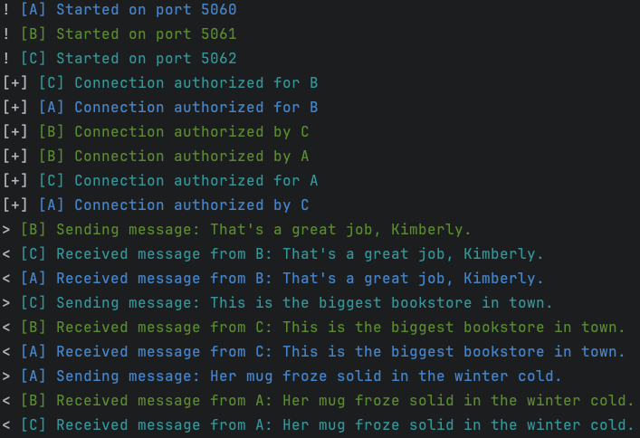

# SimpleRepeat Project Documentation

## 📄 Introduction
**SimpleRepeat** is a project demonstrating the use of the **BlueProtocol** library for TCP communication between multiple "bots". Each bot connects to a server, sends and receives messages, and synchronizes with other bots.

## 🔍 Overview
1. **Read sentences**: Reads phrases from `sentences.txt`.
2. **Create bots**: Three bots with unique IDs and console colors.
3. **Start bots**: Bots start, connect, and exchange messages.

## 💻 Code Structure

### Class `Program`
- **Main Method**:
  - Reads sentences from a file.
  - Creates a list of bots.
  - Starts each bot and waits for their completion.

- **CreateBots Method**:
  - Initializes bots with unique IDs, starting ports, console colors, and phrases.

### Class `Config`
- Contains configuration constants:
  - `StartingPort`: Initial port for bots (5060).
  - `SimulationDuration`: Simulation duration in milliseconds (60000 ms).

### Class `Bot`
- Inherits from `Controller`.
- Manages communication logic between bots.
- **Constructor**:
  - Initializes bot properties and starts the async server.
- **Methods**:
  - `Print`: Handles synchronized console output.
  - `Search`: Searches and attempts to connect to other bots on different ports.
  - `Start`: Starts the server and the loop thread.
  - `SendRandomMessage`: Sends a random message to all connected clients.
  - `Loop`: Main bot loop for managing connections and message sending.
  - `OnReceiveMessage`: Handles message reception.
  - `OnConnectionRequest`: Handles incoming connection requests, authorizing or denying connections.

### Request and Response Classes
- **Message**: Defines an event with a sender ID and message content.
- **ConnectionRequest**: Defines a connection request with an ID.
- **ConnectionResponse**: Defines a connection response with authorization status and ID.

## 📊 Example Output

## 🏁 Conclusion
This project illustrates how to use **BlueProtocol** to establish bidirectional communication between multiple TCP instances, demonstrating connection handling, message management, and client-server synchronization.